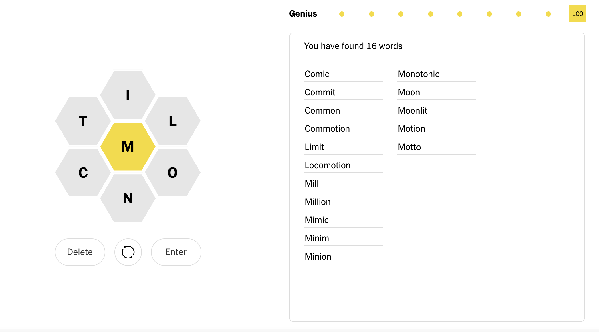

# [NYT Spelling Bee Solver](https://share.streamlit.io/daniel-chuang/spelling-bee-solver/)

Solves the daily [New York Times Spelling Bee](https://www.nytimes.com/puzzles/spelling-bee) challenge!

## What is the New York Times Spelling Bee Game?

[Link to Official Instructions](https://www.nytimes.com/2021/07/26/crosswords/spelling-bee-forum-introduction.html)

- Words must include the center letter.

- Words must contain at least four letters.

- Letters can be used more than once.

- Our word list does not include words that are offensive, obscure, hyphenated or proper nouns.

- Four-letter words are worth one point each.

- Longer words earn one point per letter. A six-letter word is worth six points.

- Each puzzle includes at least one “pangram,” which uses every letter at least once. A pangram is worth an additional seven points."

## How do I use this solver?

On the [website](https://share.streamlit.io/daniel-chuang/spelling-bee-solver/), input all of the optional letters, then all of the mandatory letters, and an output will come out!

## How does it work?

Using a [list of almost all of the words in the English language](http://www.mieliestronk.com/wordlist.html), the program creates 26 sets of words, each set representing all of the words that include one of the 26 letters anywhere in the word.

In order to find the final list, the program makes a union between all the sets of the optional letters, then intersects that with the set of the mandatory letter. Remember, union is to *or* as intersect is to *and*.

Another way to do it is by iterating through all of the combinations of the letters, but that is inefficient:

The $O(n)$ of iteration is really high (and it needs to be performed up to the length of the longest english word), and the search into the set of all words is $O(1)$. This means it would take a REALLY long time.

On the other hand, the $O(n)$ of sets operators is $O(|S_1| + |S_2|)$. This operation happens multiple times, but it's quite quick overall. The iteration through all of the final candidates to select words over length 4 is $O(n)$, but n is really small, so that is nearly negligable.

## Where can I see more of your projects?

Here's my personal website: [https://sites.google.com/view/daniel-chuang/home](https://sites.google.com/view/daniel-chuang/home)

Here's my GitHub: [https://github.com/daniel-chuang](https://github.com/daniel-chuang)
